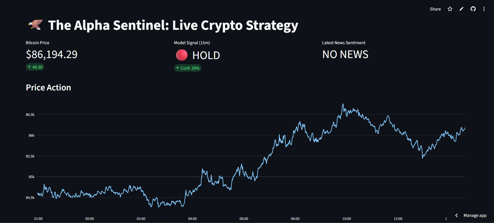

# The Alpha Sentinel: A Real-Time Cryptocurrency Strategy Engine

The Alpha Sentinel represents a comprehensive, end-to-end machine learning system designed to forecast short-term Bitcoin price fluctuations. This is achieved through the synthesis of technical analysis, specifically focusing on price action, and sentiment analysis derived from news feeds. The system incorporates a production-grade data pipeline, a real-time inference engine, and an interactive dashboard intended for the monitoring of market signals.

### System Architecture

The system architecture adopts a modern microservices-oriented approach, compartmentalized into four distinct layers:

### Data Ingestion Layer:

The ingest.py module establishes a connection with the Binance API to facilitate the streaming of live one-minute OHLCV (Open, High, Low, Close, Volume) data.

The sentiment_bot.py module polls RSS feeds, such as those from CoinDesk, and utilizes a Transformer model to evaluate and grade news sentiment.

### Storage Layer:

TimescaleDB, deployed via Docker, serves as a high-performance time-series database. This PostgreSQL extension is utilized for the efficient storage of millions of data points.

### Intelligence Layer:

FinBERT: A Transformer model from Hugging Face, fine-tuned on financial texts, is employed for sentiment classification.

XGBoost: A Gradient Boosting classifier is trained using technical indicators—namely the Relative Strength Index (RSI), Moving Average Convergence Divergence (MACD), and volatility measures—to predict price direction over a fifteen-minute horizon.

### Presentation Layer:

Streamlit: This reactive web dashboard visualizes live price data, model signals, and news feeds.

**Technology Stack**

- Programming Language: Python 3.9 or higher.

- Database Management: TimescaleDB (PostgreSQL) implemented via Docker.

- Machine Learning Models: XGBoost and FinBERT (Hugging Face Transformers).

- Data Engineering Tools: Pandas, CCXT, Feedparser, and SQLAlchemy.

- Visualization Tools: Streamlit and Plotly.

- DevOps Tools: Docker Compose.

### Project Structure

The directory structure of the project is organized as follows:

alpha-sentinel/

├── docker-compose.yml       # Configuration for database infrastructure

├── requirements.txt         # List of Python dependencies

├── ingest.py                # Worker module for fetching live price data

├── sentiment_bot.py         # Worker module for fetching and analyzing news

├── train_model.py           # Machine Learning pipeline for feature engineering and training

├── dashboard.py             # Frontend interface using Streamlit

├── check_data.py            # Utility script for database verification

└── README.md                # Project documentation

### Setup and Installation

**Prerequisites**

Ensure that Docker Desktop is installed and operational, and that Python version 3.8 or higher is available on the system.

1. Repository Cloning

Clone the repository to the local machine using the following commands:

git clone [https://github.com/pankrulez/alpha-sentinel.git](https://github.com/pankrulez/alpha-sentinel.git)

`cd alpha-sentinel`

2. Database Initialization

Initialize the TimescaleDB container using Docker Compose:

`docker-compose up -d`

3. Dependency Installation

It is recommended to create a virtual environment before installing the required libraries:

**For Windows environments**

`python -m venv venv`
`.\venv\Scripts\activate`

**For macOS and Linux environments**

`python3 -m venv venv`
`source venv/bin/activate`

**Installation of dependencies**

pip install pandas ccxt feedparser transformers torch sqlalchemy psycopg2-binary streamlit plotly pandas_ta xgboost scikit-learn yfinance

**Execution Instructions**

The system operation necessitates the concurrent execution of multiple processes, adhering to microservices principles. It is advised to open separate terminal windows for each of the following components:

Terminal 1: Data Ingestion (Price Data)

Execute the following command to initiate the script responsible for fetching live market data at one-minute intervals:

`python ingest.py`

Terminal 2: Sentiment Analysis (News Data)

Execute the following command to start the script that monitors RSS feeds and performs FinBERT analysis:

`python sentiment_bot.py`

Terminal 3: Model Training (Initial Execution Only)

To bootstrap the system, execute the training script. This process involves downloading historical data and training the initial XGBoost model:

`python train_model.py`

Note: This operation generates the model.bin file.

Terminal 4: Dashboard Launch

Execute the following command to initialize the user interface:

`streamlit run dashboard.py`

The dashboard can subsequently be accessed via a web browser at http://localhost:8501.

**Methodology**

Prediction Target

The XGBoost model functions as a binary classifier. The prediction target is defined as follows:

Objective: Determine whether the asset price will increase by more than 0.1% within the subsequent 15-minute interval.

Label 1 (BUY): Indicates a positive prediction.

Label 0 (HOLD): Indicates a negative prediction.

### Feature Engineering

The model utilizes the following technical indicators:

- Relative Strength Index (RSI) (14-period): Indicates overbought or oversold momentum conditions.

- Moving Average Convergence Divergence (MACD): Used for trend-following momentum analysis.

- Volatility (20-period): Calculated as the rolling standard deviation of returns.

- Lagged Returns: Measures past performance over 5-minute and 15-minute intervals.

### Future Enhancements

[ ] Full Containerization: Encapsulate all Python scripts within individual Docker containers to facilitate one-click deployment via docker-compose.

[ ] Backtesting Engine: Implement a simulation mode to validate the strategy against historical data sets.

[ ] Alert System: Integrate automated notifications via Telegram or Discord bots to broadcast "BUY" signals.

[ ] Cloud Deployment: Configure deployment pipelines for cloud infrastructure providers such as AWS EC2 or DigitalOcean.

### Contributing

Contributions are encouraged. For significant modifications, please initiate an issue discussion prior to submitting a pull request to ensure alignment with project objectives.

### License

This project is licensed under the MIT License.